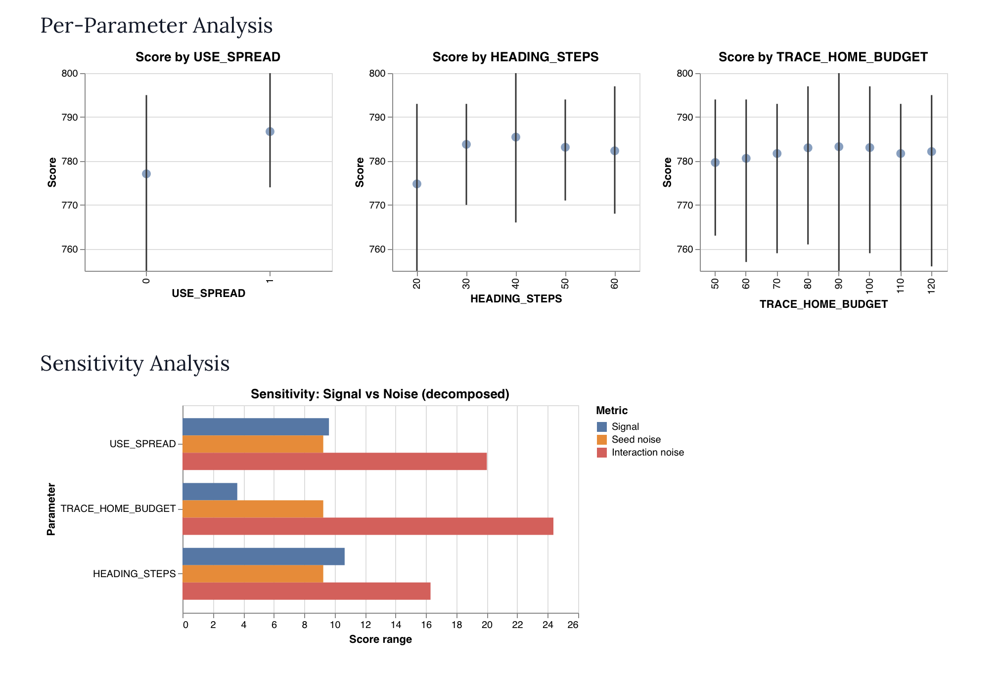

# moment-swarm

9th place submission (773/1000) for the [Moment SWARM contest](https://dev.moment.com/swarm), March 6–13, 2026. SWARM is an ant colony simulator: write a single program controlling 200 ants simultaneously to collect as much food as possible across 12 diverse maps within 2000 ticks. Every ant runs the same program independently, sharing state only through pheromones.

> 📣 If you participated in this contest and want to share your submission, please open an issue in this repository. I'll add a link to your Github / blog post!

I approached the contest as a fun opportunity to push the limits of my ability to use AI agents, and in particular to get acquainted with the Pi coding agent. I am writing a blog post with my development log that will have more details about this, follow [my blog](https://cgamesplay.com/blog/) for updates.

During this contest, I did not write a single line of "antssembly". Although it may have been fun to attempt directly making a solution in such a limited language, I didn't think that I had enough free time at this point in my life to dedicate to make a good submission. I lightly toyed with the idea of using a coding agent to write the antssembly, but that was an exercise in frustration. On a whim, I asked Claude what an s-expression based language that compiled to antssembly would look like, and [it wrote a complete implementation](https://claude.ai/share/feef75d5-0adc-4599-ad9a-c2d4aea7581f). So, that's where my entry starts.

Here's what's on this page:

- **Antlisp** is the language that Claude designed and named, which I refined over the course of the contest.
- I extracted the engine from the simulator and **ported it to node**, allowing my AI agents to quickly iterate on programs.
- I built a **hyperparameter dashboard** that I used to understand the impact of various magic numbers in my programs.
- I built an **interactive debugger** that allowed me to point the agent at a particular scenario I was seeing visually in the simulator, and have it debug the problem directly.
- In parallel with all that, I wrote 15+ different programs, building on one another, to culminate in [`tracing4.alisp`](programs/tracing4.alisp), my submission which ranked 9th overall. A compiled version is available in [`final.ant`](final.ant).

All code in this repository — compiler, engine, debugger, and ant programs — was written by AI agents. My involvement was in directing, and designing the actual algorithms used.

## Antlisp

Antlisp is a Scheme-like language that compiles to Antssembly, the native ISA for SWARM ants. It was designed for the contest's constraints: 8 registers per ant, a 64-operation budget per tick, no stack, no global communication. The language features hygienic macros (expanding inline, avoiding subroutine overhead), `loop`/`tagbody` control flow, and ant-specific primitives like `sense`, `smell`, `mark`, `pickup`, and `drop`. See [`ANTLISP.md`](ANTLISP.md) for the full reference.

Here's a minimal forager — macros expand inline to track displacement, pheromones guide other ants to food, and dead-reckoning navigates home:

```lisp
; move-track: move in dir, then update dead-reckoning registers
(defmacro move-track (dir dx dy)
  (move dir)
  (cond ((= dir 1) (set! dy (- dy 1)))
        ((= dir 2) (set! dx (+ dx 1)))
        ((= dir 3) (set! dy (+ dy 1)))
        ((= dir 4) (set! dx (- dx 1)))))

(let ((dx 0) (dy 0))
  (loop
    (if (carrying?)
      ; Navigate home: pick axis with greater displacement, step toward zero
      (let ((adx (if (< dx 0) (- 0 dx) dx))
            (ady (if (< dy 0) (- 0 dy) dy))
            (nest-dir (sense nest)))
        (if (!= nest-dir 0)
          (begin (move nest-dir) (drop) (set! dx 0) (set! dy 0))
          (move-track (if (> ady adx) (if (> dy 0) 1 3)
                                      (if (> dx 0) 4 2)) dx dy)))
      ; Search: pick up adjacent food, or follow pheromone trail, or wander
      (let ((food-dir (sense food)))
        (if (!= food-dir 0)
          (begin (move-track food-dir dx dy) (pickup) (mark ch_red 100))
          (move-track (let ((trail (smell ch_red)))
                        (if (!= trail 0) trail (+ (random 4) 1)))
                      dx dy))))))
```

See [`example.alisp`](example.alisp) for a faithful reproduction of the official example program.

## The Node Engine

The contest simulator runs in the browser, so on Day 2 the engine JavaScript was extracted from the website bundle and rebuilt as a standalone Node.js module. This let agents compile and test programs in a tight loop without leaving the terminal. The test runner reports per-map food collection ratios, timing, stall counts (ticks where an ant exhausts its 64-op budget without reaching a move), and abort counts (from user-defined `(abort! N)` calls or built-in engine codes for wall collisions and invalid directions). Stall counts were essential for diagnosing programs generating too much antssembly.

```
$ argc test --no-debug example.alisp
Assembled 80 instructions
  chambers-3lc8x4             26/ 1044  (  2.5%)        0 stalls      0 aborts  93ms
  bridge-1u7xlw                0/  673  (  0.0%)        0 stalls      0 aborts  60ms
  gauntlet-41jczs              0/ 1315  (  0.0%)        0 stalls      0 aborts  61ms
  islands-3ekzho               2/  852  (  0.2%)        0 stalls      0 aborts  65ms
  open-38bs6g                105/ 1140  (  9.2%)        0 stalls      0 aborts  61ms
  brush-3c3sbo                 0/  676  (  0.0%)        0 stalls      0 aborts  62ms
  prairie-pgwqb              213/  724  ( 29.4%)        0 stalls      0 aborts  61ms
  field-hjbev                 75/  955  (  7.9%)        0 stalls      0 aborts  62ms
  pockets-1545v7               0/ 1001  (  0.0%)        0 stalls      0 aborts  62ms
  fortress-2wwxqn              0/ 1256  (  0.0%)        0 stalls      0 aborts  61ms
  maze-r4177                   0/ 1189  (  0.0%)        0 stalls      0 aborts  61ms
  spiral-zu9av                44/  964  (  4.6%)        0 stalls      0 aborts  66ms

Score: 45/1000  (4.5% avg collection, 12 maps, 0 stalls, 775ms)
```

## The Hyperparameter Dashboard

Many ant behaviors are governed by numeric constants — how long to follow a wall, how often to detach, how large a spiral to search. The hyperparameter dashboard is a [Marimo](https://marimo.io) notebook (`hyperparameters.py`) that reads `; @hp min=... max=... step=...` annotations directly from `.alisp` source files, sweeps parameter combinations in parallel across multiple seeds, and plots the results. Running a coarse sweep and then zooming in around the best values typically took a few minutes and often yielded 5–15 point improvements, particularly after testing a new algorithm.



## The Interactive Debugger

`argc debug` launches a time-traveling interactive debugger: set breakpoints by ant ID and tick, step instruction-by-instruction, inspect register state and sensor readings, and render a pheromone map — all from the terminal. This unlocked a new debugging workflow: spot a problem in the browser simulator, note the ant ID and tick, hand it to an agent via the tmux skill. The agent would break on that exact ant, read the register state, trace the logic, and identify the bug — fully automatically.

Here's a session on `tracing4.alisp`, breaking on ant #7 as it returns home with food:

```
$ argc debug programs/tracing4.alisp -m open
Assembled 990 instructions
  990 instructions, map=open-38bs6g, seed=42, ants=200
  Food: 1140 total, ticks: 2000
Type "help" for commands.

dbg> forward 300
Advanced to tick 300.

dbg> break --id 7 --tick 305
Breakpoint #1 added: id=7 tick=305

dbg> continue
Breakpoint hit: ant #7 at tick 305, pc=287

dbg> info 7
Ant #7  tick=305  pc=287  tag=exploring  pos=(67,90)  carrying=false  aborted=no
Registers:
  thb(r0)    = 0x0000001e (        30)  homepos(r1) = 0x00000100 (       256)
  r2         = 0x00000100 (       256)  dir(r3)    = 0x00000003 (         3)
  r4         = 0x00000004 (         4)  r5         = 0x00000009 (         9)
  r6         = 0x000000b3 (       179)  r7         = 0x00000000 (         0)

Sensors:
  PROBE N=NEST  E=EMPTY  S=NEST  W=NEST
  SNIFF CH_RED       HERE(242) N(254) E(103) S(252) W(138)
  SNIFF CH_BLUE      HERE(0) N(0) E(0) S(0) W(0)
  SNIFF CH_GREEN     HERE(0) N(0) E(0) S(0) W(0)
  CARRYING=0  ID=7

dbg> map 7
Space:
. . . . .
N N N . .
N N @ . .
N N N . .
. . . . .
Ants:
. . . . .
2 . . 1 .
. . @ . .
1 . 1 . .
1 . 1 . .
Pheromones (ch0  ch1  ch2  ch3):
d9 8c f4 00 00   00 00 00 00 00   00 00 00 00 00   00 00 00 00 00
f4 fd fe e0 ec   00 00 00 00 00   00 00 00 00 b1   00 00 00 00 00
f5 8a f2 67 ed   00 00 00 00 00   00 00 00 00 b0   00 00 00 00 00
fc fb fc ef ee   00 00 00 00 00   00 00 00 00 af   00 00 00 00 00
fd 88 fd 18 00   00 00 00 00 00   00 00 00 00 00   00 00 00 00 00
```

The map view shows ant #7 (`@`) has just dropped its food at the nest (`N`) and resumed exploring. `ch0` (red) shows a strong home gradient spreading from the nest. `ch2` (green) has a faint food trail to the east — the path this ant just walked while carrying food.

## tracing4.alisp — The 9th Place Submission

The compiled version, if you want to check the performance directly, is available at [`final.ant`](final.ant).

[`programs/tracing4.alisp`](programs/tracing4.alisp) was the final submission, scoring 773/1000 on the leaderboard (9th place). There are 2 key concepts: **pheromone gradient upkeep** and **wall tracing**. Each ant is represented as a state machine, with 5 states.

**Pheromone channels used:**

| Channel | Purpose |
|---|---|
| Red: `TRAIL_PH` | Gradient trail marking the path from food back to nest |
| Green: `DELIVERING_PH` | Breadcrumb dropped by food-carrying ants heading home |
| Blue: `PICKUP_PH` | Beacon left where food was picked up |

### States

#### State: Exploring

This is the initial state. It represents ants searching open areas for food.

- Moves in a random direction for `HEADING_STEPS` ticks before picking a new heading
- Follows `DELIVERING_PH` (green) trails toward food when detected nearby
- Senses food and picks it up if adjacent → transitions to **Returning**
- If it detects a `PICKUP_PH` (blue) pheromone with no food present → transitions to **Spiraling**
- If it hits a wall → transitions to **Tracing-Out**
- Continuously lays `TRAIL_PH` (red) gradient

#### State: Tracing-Out

If an ant is exploring and encounters a wall, it enters this state and attempts to follow the wall. It has a random chance to break away from the wall and continue exploring, especially if it detects that it just passed through an opening.

- Follows the wall using the shared `do-trace-step` routine (see below)
- Detaches when: a random chance fires (`WALL_LEAVE_CHANCE`), a `DELIVERING_PH` trail is detected, or an opening is found (`OPENING_ENTER_CHANCE`)
- Has the same logic as exploring for sensing food and following `DELIVERING_PH` trails.

#### State: Spiraling

When an ant detects the `PICKUP_PH` (blue) pheromone while exploring, it enters this state to attempt to find more food nearby. It is an outward spiral search.

- Performs an outward rectangular spiral in rings of 3-cell spacing, matching the ant's sensing width
- Leg lengths follow the pattern 3, 3, 6, 6, 9, 9, … — each ring is one sensing-width farther out
- Picks up food if found → **Returning**
- Returns to **Exploring** when the spiral completes

#### State: Returning

When an ant has found food and needs to bring it home.

- Drops `DELIVERING_PH` (green) breadcrumbs the entire way home (so other ants can find this food spot)
- Primarily follows the `TRAIL_PH` (red) gradient toward the nest
- Falls back to **dead-reckoning** via a packed `homepos` register (dx/dy displacement) if no gradient is available
- On arrival at nest: drops food, resets `homepos` → **Exploring**
- If the dead-reckoned direction is blocked by a wall → **Tracing-Home**

#### State: Tracing-Home

When an ant has food, but the path home is blocked by a wall.

- Like Tracing-Out but goal-directed: remembers the direction it was originally blocked (`tdir`)
- **Escape condition**: when `dir == tdir` AND the wall-side is clear → wall has ended, resumes **Returning**
- Has a step budget (`TRACE_HOME_BUDGET = 80`); bails back to **Returning** if exceeded, to avoid getting stuck
- Still drops `DELIVERING_PH` and marks `TRAIL_PH` while tracing

#### Shared Wall-Following: `do-trace-step`

The one-step wall-following logic is shared between Tracing-Out and Tracing-Home by placing it at the bottom of the tracing-home loop body. It's not a state, but implementing it like a state was necessary to reduce instruction count (using a macro would duplicate the code each time). The dispatch uses the `tdir` variable:

- `tdir = 0` → caller was **Tracing-Out** → jump back to tracing-out
- `tdir = 1–4` → caller was **Tracing-Home** → check escape condition

Each step follows this priority:

1. **Wall-side open** → turn toward it (follow concave corner)
2. **Ahead open** → walk forward (wall alongside)
3. **Ahead blocked** → turn away (convex corner)
4. **Still blocked** → reverse (dead end)

### Pheromone Gradient Maintenance

The `TRAIL_PH` (red) and `DELIVERING_PH` (green) channels are maintained by ants as a gradient that gets stronger *towards* the target (the nest or food). Logically this requires that a single ant would mark 255 at the target, then 253 one cell away, because while the ant was moving the gradient decayed by one tick. The logic lives in the `mark-gradient` macro.

- **At the seed** (adjacent to the nest or food): the ant tops up the local cell to 255, marking the deficit: `mark ch (255 - current)`.
- **Everywhere else**: the ant sniffs the strongest-neighbor direction using `smell`, then reads that neighbor's intensity with a single `sniff`. If `neighbor - 1 > current`, the ant marks the deficit to pull its cell up to `neighbor - 1`.

This means each ant reinforces the gradient as it travels, ensuring cells near the nest stay close to 255 and the slope decays by roughly 1 per step outward. Many ants doing this together cause a gradient to emerge and hopefully persist.

A lighter variant, `mark-gradient-propagate`, skips the seed check and is used in states where the ant is known to be far from the nest. This saves ~6 instructions per use.

### Packed Dead Reckoning

This code lives in [`programs/packed-dr.inc.alisp`](programs/packed-dr.inc.alisp). With only 8 registers per ant, every register is precious. Dead-reckoning requires tracking two values — the ant's dx and dy displacement from the nest — but spending two full registers on them was too expensive. I reduced the overhead by packing both coordinates into a single register.

Maps are 128×128 cells, so dx and dy each fit in a signed 8-bit integer (range −128 to 127). `homepos` stores them in the low two bytes of a 32-bit register:

```
bits  7:0   → dx  (signed 8-bit, two's complement)
bits 15:8   → dy  (signed 8-bit, two's complement)
bits 31:16  → unused
```

A set of primitives (`inc-dx!`, `dec-dy!`, etc.) update the individual bytes in-place using bit masking, so no unpacking is needed on every move. The `move-track-unsafe` macro combines a move with the appropriate byte update in a single expansion. 

When an ant needs to navigate home, `home-dir` unpacks dx and dy, compares their absolute values, and sets `dir` to step along the dominant axis toward zero.

Resetting `homepos` to 0 on nest arrival appears to be a latent bug. It may be covering up some other bug, but logically there shouldn't be any need to do it and this may have interfered with other experiments trying to use the two unused bytes of this register for other purposes.
